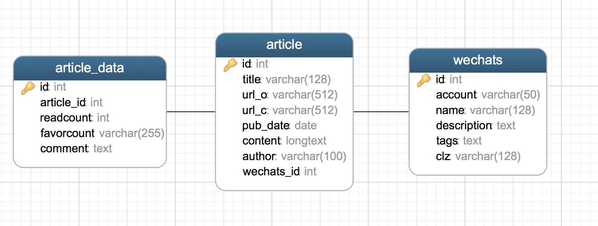
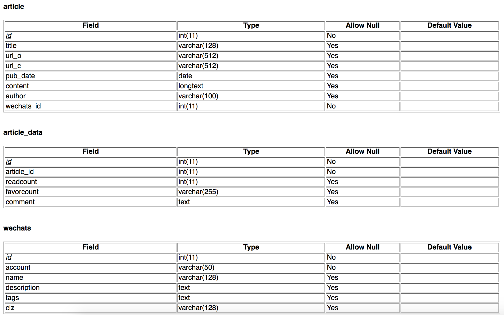

# 微信文章采集

## 介绍
#### 工程结构
test 测试脚本不需要关心
tools 提供从mongo到mysql的数据转存和文件到mysql的转存脚本
weixin scrapy爬虫工程文件夹
－－spider/
－－－csmSpider.py  传送门
－－－sougouwxSpider.py 搜狗微信
－－－weixin_sgwx_spider.py  基于开源WechatSogouApi，但是会出现验证码问题，可以尝试验证码识别和换ip来实现
－－－weixinspider.py  新榜数据前500
－－－wxqSpider.py 从微信群网站只收集公众号信息

1. 现在主要运行的是csmSpider收集传送门历史文章，把收集到的item
按json格式按行写入文件，文件在工程的根目录下以开始爬取时间为名字
（应该改成时间戳）然后在服务器定时执行tools下filetomysql.py脚本
定时把csmSpider生成的数据写入提供的mysql服务器。
2. sougouwxSpider 主要搜集搜狗微信上的公众号和文章在scrapyd上运行，
 由于服务器上的mongodb暂停没有再跑

# 环境
scrapy
scrapyd

# 数据库
## ER图

## 表结构

# 实施
文件位置：爬虫服务器/home/minghui/myprojects/*

